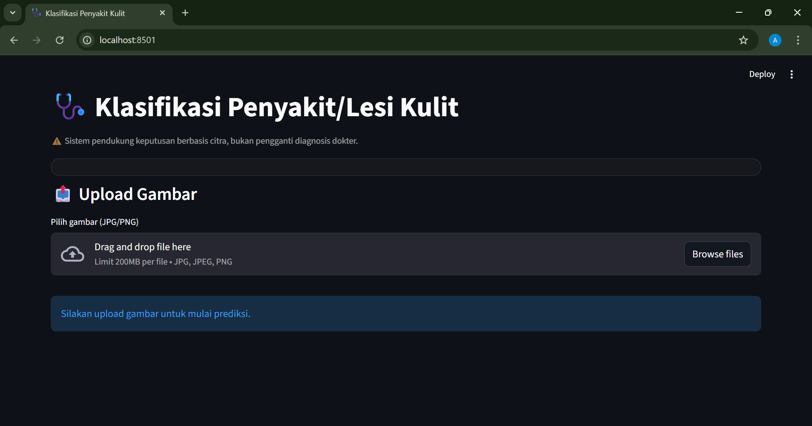
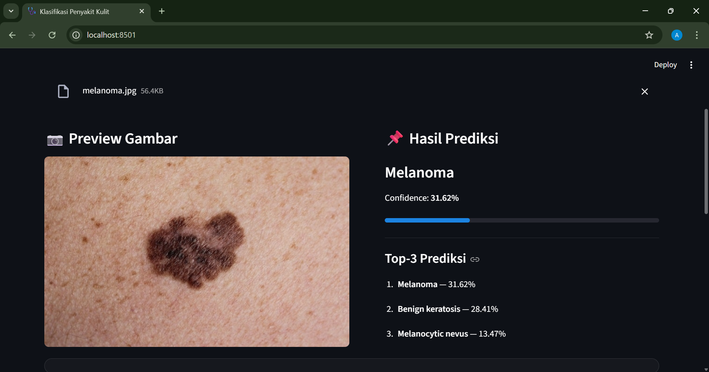

# Sistem Klasifikasi Penyakit Kulit

## Deskripsi Proyek
Aplikasi ini berbasis **pengolahan citra digital** dan **deep learning** menggunakan metode **Convolutional Neural Network (CNN)** dengan teknik transfer learning untuk mengenali pola visual pada citra kulit. Proyek ini dikembangkan sebagai tugas akhir mata kuliah Pengolahan Citra Digital pada Program Studi Teknik Informatika.

> **Catatan:** Aplikasi ini merupakan sistem pendukung keputusan, bukan pengganti diagnosis medis oleh dokter.

## Getting Access

## Metode yang Digunakan
- Deep Learning
- Convolutional Neural Network (CNN)
- Transfer Learning (EfficientNet)
- Image Preprocessing & Data Augmentation
- Explainable AI (Grad-CAM)

## Library & Tools

### 🔹 Bahasa Pemrograman
- **Python 3**

### 🔹 Library Utama
| Library | Kegunaan |
|-------|---------|
| `torch` | Framework deep learning |
| `torchvision` | Dataset & transformasi citra |
| `timm` | Pretrained CNN (EfficientNet) |
| `scikit-learn` | Evaluasi model |
| `numpy` | Operasi numerik |
| `opencv-python` | Image processing & Grad-CAM |
| `Pillow` | Manipulasi citra |
| `Streamlit` | Web application |

## Screenshot

<table>
  <tr>
    <td align="center">
      
       
      <b>Upload Gambar</b>
       
    </td>
    <td align="center">
      
       
      <b>Preview Gambar</b>
       
    </td>
  </tr>
</table>

